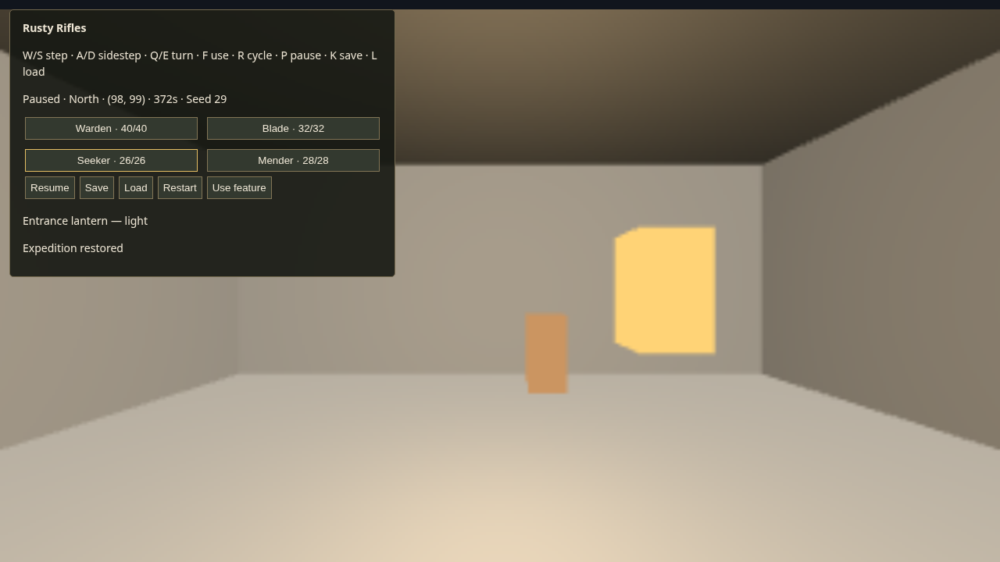

# Milestone 1 verification

Implementation: `5afc007fd2a753f61f172a958778f65893996128` on `main` (2026-09-13).
Tasks: A01 #8188, A02 #8189, A03 #8191, A04 #8196, A05 #8192, A06 #8197.

`bash scripts/check.sh` passed: UI typecheck, solution build, procgen checks,
game checks, offline tool self-check and CoreCLR staging, with no build warnings.
Game checks cover content rejection/retuning, connected/replayable generation,
exact transit commits, contested reservations/cancellation, snapshot serialization
and invalid-state rejection, resumed actor motion, and target revalidation.
The runtime uses the installed SDK/runtime pair `0.1.0-dev.2e4255bd3ad5`.

## Ordinary-control evidence

Crew-services `playtest`, `rusty-rifles` profile, browser backend. DOM inspection
and keyboard activation of visible buttons assisted UI testing; movement and
world use used ordinary keyboard input. No debug gameplay state writes were used.

- Session `dbe5b2fc-448d-4b5e-9faa-c46f976998d8`: W/S movement and held release,
  A/D strafing, Q/E turning; explicit pause and unchanged clock after idle; Seeker
  selection; nearby lantern focus and F use switched it off with visible feedback.
- That session saved paused North `(98,99)`, time `372s`, Seeker selected, lantern
  off. Its first load test exposed a real appearance-lifetime fault, subsequently
  fixed: publish replacement references before disposing previous appearances.
- Session `216e7780-b6a1-41be-a69f-8657b478ee8f`, after the fix and worker replacement:
  UI Load restored that state, and Restart followed by Load restored it again.
- A new browser session `01d8d44c-958a-4b31-acc2-1b5f3d63ab2d` restored the same
  state again. The original final capture is copied unchanged below.
- Final runtime diagnostics after the previous failure cursor contained no new
  errors. Browser captures recorded recurring GPU ReadPixels performance warnings,
  without page errors. All test-owned browser sessions were stopped successfully.

Original final capture:
`/home/agent/.local/state/crew-playtest/browser/01d8d44c-958a-4b31-acc2-1b5f3d63ab2d/79dabb56-7573-48ae-afb1-f44dee520f7b.png`.
Each listed session's `events.jsonl` is under the same service browser directory.
Other useful capture IDs: `0876c466-3ca1-42f4-8f54-bffc583a3982` (paused),
`26517429-5678-4a71-8003-134762b6a039` (paused after idle),
`f8e6f781-1534-4576-8c8e-b3bd2416af9d` (lantern off),
`ab847de1-b221-409d-92e8-1c6497c1c7b5` (saved),
`72ee3373-e53d-4033-be25-5b7afb16803d` (fresh load),
`e79fff3d-5fed-413a-9f77-ba5544ad4e59` (restart/load).

## Review disposition and scope

Fixed the identified malformed-save cases: disconnected/bad-bound floors,
porter actions pointing away from their route, and overflowing lantern revisions.
Exit inspection remains repeatable, with a new target revision on first use;
fresh reinspection is intentional, while old target observations become stale.

This establishes exploration primitives. It does not claim final art, combat,
enemy tactical AI, inventory, doors, or multi-floor progression. Those remain in
the agreed subsequent campaign tasks. The visible porter/lantern primitives are
initial presentation callers; milestone 2 adds the generated visual ensemble.
