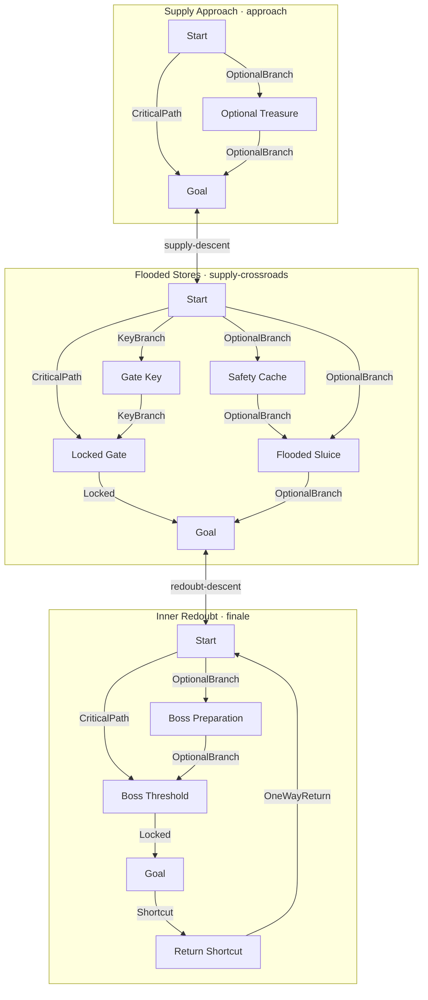

# Resolved expedition graph

This diagram is generated from `rifles.expedition.read` on the staged runtime.
It shows logical intent, not realized rooms, physical locks, or playable floor travel.

```mermaid
flowchart TD
  subgraph arrival["Supply Approach · approach"]
    n0["Start"]
    n1["Goal"]
    n2["Optional Treasure"]
    n0 -->|CriticalPath| n1
    n0 -->|OptionalBranch| n2
    n2 -->|OptionalBranch| n1
  end
  subgraph stores["Flooded Stores · supply-crossroads"]
    n3["Start"]
    n4["Goal"]
    n5["Locked Gate"]
    n6["Gate Key"]
    n7["Flooded Sluice"]
    n8["Safety Cache"]
    n3 -->|CriticalPath| n5
    n5 -->|Locked| n4
    n3 -->|KeyBranch| n6
    n6 -->|KeyBranch| n5
    n3 -->|OptionalBranch| n8
    n8 -->|OptionalBranch| n7
    n3 -->|OptionalBranch| n7
    n7 -->|OptionalBranch| n4
  end
  subgraph redoubt["Inner Redoubt · finale"]
    n9["Start"]
    n10["Goal"]
    n11["Boss Threshold"]
    n12["Boss Preparation"]
    n13["Return Shortcut"]
    n9 -->|CriticalPath| n11
    n11 -->|Locked| n10
    n9 -->|OptionalBranch| n12
    n12 -->|OptionalBranch| n11
    n10 -->|Shortcut| n13
    n13 -->|OneWayReturn| n9
  end
  n1 <-->|supply-descent| n3
  n4 <-->|redoubt-descent| n9
```
